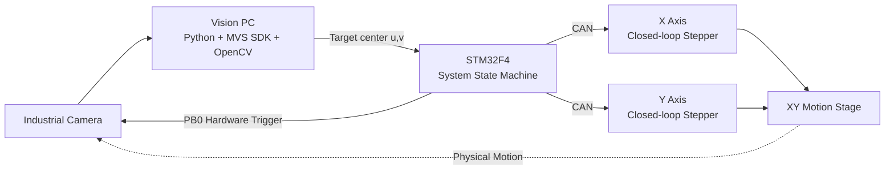

# STM32 Motor Control Journey

> From basic peripherals to dual-axis vision-guided closed-loop motion control.

这是一个持续演进的 STM32 电机控制学习与工程实践仓库。项目从 GPIO、定时器、PWM、串口等基础外设出发，逐步扩展到直流电机 PID、步进电机控制、多轴插补、Homing、FOC 学习、CAN + FreeRTOS 双轴控制，最终完成工业相机 + OpenCV + STM32 的 XY 视觉闭环集成。

本仓库更强调 **“Journey”**：每个目录都保留一个阶段的实现、问题与迭代过程，而不是只展示最终代码。

---

## Project Overview

当前仓库主线已经推进到：

- 双轴闭环步进电机控制
- CAN 通信与位置反馈
- FreeRTOS 下的双轴运动任务
- 非阻塞 Homing / Camera-Ready 状态机
- STM32 硬件触发工业相机
- Python + MVS SDK 图像采集
- OpenCV 黑点检测与灰度加权中心定位
- Vision XY closed-loop integration

默认分支：`main`

最新阶段里程碑：`vision-xy-closed-loop-v1`

---

## System Architecture



系统的核心思路是把 **视觉感知、运动控制和嵌入式状态机** 串成一条完整链路：

```text
Camera Trigger
    ↓
Image Acquisition
    ↓
Target Detection
    ↓
Center (u, v)
    ↓
STM32 Motion Logic
    ↓
CAN Dual-Axis Motion
    ↓
XY Stage
```

---

## Learning Roadmap

| Stage | Directory | Focus |
|---|---|---|
| 01 | [`01_Basic_Peripherals`](./01_Basic_Peripherals) | GPIO、TIM、PWM、USART 等 STM32 基础外设 |
| 02 | [`02_DC_Motor_PID`](./02_DC_Motor_PID) | 直流电机位置/速度闭环与 PID 调参 |
| 03 | [`03_Stepper_Basic`](./03_Stepper_Basic) | 步进电机脉冲驱动、定时器与基础开环控制 |
| 04 | [`04_Stepper_Interpolation_Lab`](./04_Stepper_Interpolation_Lab) | 多轴插补、Homing、协议解析、Ring Buffer 等运动控制基础 |
| 05 | [`05_DengFOC_Handwritten_OOP_3Loop`](./05_DengFOC_Handwritten_OOP_3Loop) | 手写 FOC、OOP 结构与三环控制学习 |
| 06 | [`06_CAN_Stepper_RTOS`](./06_CAN_Stepper_RTOS) | CAN、FreeRTOS、双轴非阻塞运动与位置反馈 |
| 07 | [`07_Vision_XY_Integration`](./07_Vision_XY_Integration) | 工业相机、OpenCV、硬件触发与视觉 XY 闭环集成 |

---

## 01 — Basic Peripherals

[`01_Basic_Peripherals`](./01_Basic_Peripherals)

从 STM32 最基础的外设开始建立底层能力，包括：

- GPIO / LED Blink
- General-purpose Timer
- PWM waveform generation
- USART basic communication

这一阶段的重点不是复杂算法，而是把后续电机控制需要的定时、脉冲和通信基础打牢。

---

## 02 — DC Motor PID

[`02_DC_Motor_PID`](./02_DC_Motor_PID)

直流有刷减速电机闭环控制实验，主要包括：

- Position PID
- Incremental PID
- Speed / position feedback
- PID 参数调试
- 梯形轨迹思路与低速抖动问题分析

这一阶段开始从“让电机转起来”进入“让电机按目标运动”。

---

## 03 — Stepper Basic

[`03_Stepper_Basic`](./03_Stepper_Basic)

步进电机基础控制，包括：

- STEP / DIR pulse control
- Timer-based pulse generation
- 主从定时器级联
- Basic open-loop positioning

这一阶段完成了从直流电机闭环学习向精确位置型运动控制的过渡。

---

## 04 — Stepper Interpolation Lab

[`04_Stepper_Interpolation_Lab`](./04_Stepper_Interpolation_Lab)

这是仓库中非常重要的运动控制实验阶段，逐步加入了：

- Multi-axis interpolation
- Bresenham interpolation
- Circular interpolation experiments
- S-curve / acceleration related experiments
- Ring Buffer
- Non-blocking Homing FSM
- Position inheritance / command protection
- Lightweight command parser
- Python host visualization experiments

这一阶段经历了较多软硬件联调问题，也形成了后续 CAN / RTOS / Vision 阶段继续复用的运动控制思路。

相比早期版本，当前 README 不再把这一阶段描述为“最终版本”，而把它视为整个项目演进中的一个关键基础阶段。

---

## 05 — Handwritten FOC / OOP / 3-Loop

[`05_DengFOC_Handwritten_OOP_3Loop`](./05_DengFOC_Handwritten_OOP_3Loop)

这一阶段用于学习和实现手写 FOC，并尝试使用更模块化、面向对象风格的方式组织控制代码。

核心目的包括：

- 理解 FOC 基本控制链
- 学习多环控制结构
- 练习控制模块解耦
- 从“能运行的代码”向“可维护的控制软件结构”过渡

---

## 06 — CAN Stepper + FreeRTOS

[`06_CAN_Stepper_RTOS`](./06_CAN_Stepper_RTOS)

项目在这一阶段进入双轴闭环运动控制。

主要内容包括：

- FreeRTOS task practice
- Dual-axis CAN communication
- Non-blocking multi-axis motion control
- CAN position feedback
- MKS closed-loop stepper integration
- X / Y independent motion state
- Homing and motion sequencing
- System-level state machine integration

这一阶段的核心变化是：系统不再只是单轴算法实验，而开始变成一个真正的 **multi-axis embedded motion system**。

---

## 07 — Vision XY Integration

[`07_Vision_XY_Integration`](./07_Vision_XY_Integration)

这是当前主线阶段。

系统已经完成：

- STM32 Camera-Ready positioning
- PB0 hardware trigger
- Industrial camera image acquisition through MVS SDK
- Python image acquisition pipeline
- OpenCV ROI processing
- Black target contour detection
- Bounding-box diagnostics
- Local grayscale intensity-weighted centroid
- Dual-axis vision closed-loop integration

当前视觉定位链路采用：

```text
ROI
 ↓
Grayscale
 ↓
Gaussian Blur
 ↓
Otsu Segmentation
 ↓
Contour Coarse Localization
 ↓
Local Grayscale Weighted Centroid
 ↓
Target Center (u, v)
```

其中轮廓主要负责 **粗定位**，局部灰度加权中心负责进一步计算黑点中心。

---

## Vision Detection Pipeline

当前视觉部分重点关注的不是“复杂目标识别”，而是 **固定场景下的高重复性位置测量**。

输出重点包括：

```text
bbox = (x, y, w, h)
center = (u, v)
```

其中：

- `bbox` 用于判断目标轮廓是否发生整体位移
- `(u, v)` 用于最终视觉定位
- 多帧保存用于区分视觉噪声、机械重复性和运动到位误差

---

## Milestones / Tags

仓库保留了几个阶段性里程碑：

| Tag | Meaning |
|---|---|
| `V5.0_Stable` | Stepper interpolation / Homing / protocol-engine stable baseline |
| `rtos-dual-axis-v1.0` | FreeRTOS + dual-axis CAN control milestone |
| `vision-xy-closed-loop-v1` | Dual-axis vision closed-loop integration milestone |

这些 Tag 用于保留重要阶段，而 `main` 始终保持当前最新主线。

---

## Key Engineering Ideas

整个 Journey 中反复使用并逐步完善的核心思路包括：

### Non-blocking State Machines

尽量避免用长时间阻塞式流程组织运动逻辑，而是使用状态机拆分：

```text
START
 ↓
MOVE
 ↓
WAIT
 ↓
VERIFY
 ↓
NEXT STATE
```

这使 Homing、双轴运动、Camera-Ready 与硬件触发能够组合到同一个系统流程中。

### Motion Feedback Instead of Blind Timing

运动完成判断逐步从“等待固定时间”转向：

- Motion state
- Encoder feedback
- Position error
- Stable-position confirmation

目标是让系统只在位置真正可信时继续下一阶段。

### Separation of Motion and Vision

视觉测量和机械运动尽量分开验证：

```text
Pure Camera Repeatability
        vs
Home / Reposition Repeatability
```

这样可以区分：

- 图像算法漂移
- 相机输入变化
- 滑台重复定位误差
- Motion / CAN 异常

### Debug with Evidence

项目中逐步增加：

- `bbox`
- target center
- motion result
- state snapshots
- saved frames
- Git milestones

用于减少“凭感觉改参数”的调试方式。

---

## Repository Structure

```text
STM32_Motor_Control_Journey/
├── 01_Basic_Peripherals/
├── 02_DC_Motor_PID/
├── 03_Stepper_Basic/
├── 04_Stepper_Interpolation_Lab/
├── 05_DengFOC_Handwritten_OOP_3Loop/
├── 06_CAN_Stepper_RTOS/
├── 07_Vision_XY_Integration/
├── .gitignore
└── README.md
```

---

## Tech Stack

### Embedded

- STM32F1 / STM32F4
- C
- Keil MDK
- STM32 HAL / LL
- FreeRTOS
- CAN
- UART
- TIM / PWM
- GPIO hardware trigger

### Motion Control

- PID
- Stepper pulse control
- Bresenham interpolation
- Homing FSM
- Ring Buffer
- Closed-loop stepper feedback
- Dual-axis motion sequencing

### PC / Vision

- Python 3
- OpenCV
- MVS SDK
- pyserial
- CustomTkinter
- Matplotlib
- Multithreading

### Engineering Workflow

- Git
- GitHub
- Branch-based development
- Milestone Tags
- Logic-analyzer / runtime debugging
- Incremental hardware-software integration

---

## Current Engineering Focus

当前系统已经完成视觉 + 双轴运动控制的功能集成，但仍在继续做可靠性收敛。

当前重点包括：

1. **Reset network reliability**  
   继续确认异常复位与 NRST 网络之间的关系，提高整机运行稳定性。

2. **Camera-Ready position verification**  
   在触发拍照前进一步确认 X / Y 实际位置，避免运动未真正到位时采集无效图像。

3. **CAN / Motion robustness**  
   继续验证命令、反馈、超时与位置完成判定之间的可靠配合。

4. **Vision repeatability**  
   固定照明、曝光和增益后，区分纯视觉重复性与机械重复定位误差。

5. **Vision-to-motion calibration**  
   在机械与视觉输入稳定后继续完成像素坐标与 XY 运动坐标之间的标定。

---

## Demo / Results

当前已完成：

- Camera-Ready motion
- Hardware-triggered image capture
- Target detection
- Weighted-center localization
- Dual-axis vision closed-loop integration

项目成果图、重复性测试和标定结果将在后续整理后补充到本节。

---

## Why This Repository Exists

这个仓库并不是一个“一开始就设计完成”的最终产品。

它记录的是一条真实的学习和工程演进路线：

```text
Basic STM32
    ↓
DC Motor PID
    ↓
Stepper Motor
    ↓
Interpolation + Homing
    ↓
FOC / Control Architecture
    ↓
CAN + FreeRTOS Dual Axis
    ↓
Computer Vision
    ↓
Vision-Guided XY Closed Loop
```

过程中遇到过协议解析、运动到位、Homing、通信、复位、视觉重复性等问题，也保留了对应阶段的代码和里程碑。

对我而言，这个仓库的价值不只是“最终能运行”，而是记录 **一个运动控制系统如何一步一步被搭建、调试和验证出来**。

---

##状态

`main` — active development

Latest milestone:

```text
vision-xy-closed-loop-v1
```

Next focus:

```text
Reliability hardening
→ Camera-ready position interlock
→ Vision repeatability
→ XY calibration
```
